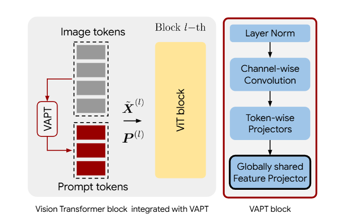

# Revisit Visual Prompt Tuning: The Expressiveness of Prompt Experts (ICLR 2026)

<div align="center">

[](LICENSE)
[](https://arxiv.org/abs/2501.18936)
[](.)
[](https://iclr.cc/)

**Official PyTorch implementation of the ICLR 2026 paper.**

</div>

## Table of Contents
- [📖 Abstract](#-abstract)
- [🛠 Installation](#-installation)
- [📂 Repository Structure](#-repository-structure)
- [💾 Data Preparation](#-data-preparation)
- [🤖 Pre-trained Models](#-pre-trained-models)
- [🚀 Usage & Experiments](#-usage--experiments)
- [🖊️ Citation](#-citation)
- [📜 License](#-license)

---

## 📖 Abstract

Visual Prompt Tuning (VPT) has proven effective for parameter-efficient adaptation of pre-trained vision models to downstream tasks by inserting task-specific learnable prompt tokens. Despite its empirical success, a comprehensive theoretical understanding of VPT remains an active area of research.

Building on the established connection between Mixture of Experts (MoE) and prompt-based methods—wherein each attention head can be conceptualized as a composition of multiple MoE models—we reinterpret VPT as the introduction of new **prompt experts** into these MoE structures. We identify a key limitation in existing VPT frameworks: the *restricted functional expressiveness* of prompt experts, which remain static and limited in adaptability.

To address this, we propose **Visual Adaptive Prompt Tuning (VAPT)**, a novel method that endows prompt experts with enhanced expressiveness while preserving parameter efficiency.

**Key Achievements:**
*   **Performance:** VAPT surpasses fully fine-tuned baselines by **7.34%** on VTAB-1K and **1.04%** on FGVC.
*   **Efficiency:** Consistently outperforms VPT while requiring fewer additional parameters.
*   **Theory:** Theoretical analysis indicates that VAPT achieves optimal sample efficiency.



---

## 🛠 Installation

### Requirements
*   Python 3.8.12
*   PyTorch 1.7.1
*   torchvision 0.8.2
*   timm 0.5.4
*   CUDA 11.0

### Environment Setup
You can set up the environment using Conda:

```bash
conda create -n vapt python=3.8.12 -y
conda activate vapt
bash env_install.sh
```
*Note: Refer to `env_setup.sh` if you encounter issues during installation.*

---

## 📂 Repository Structure

Key files and directories are highlighted below:

*   `src/configs`: Configuration files for experiments.
    *   👉 `src/config/config.py`: **Main configuration hub.** Defines all parameters and default settings.
*   `src/data`: Dataset loading and processing.
    *   Includes `vtab_datasets` adapted from the [VTAB repository](https://github.com/google-research/task_adaptation/tree/master/task_adaptation/data).
*   `src/engine`: Main training and evaluation loops.
*   `src/models`: Backbone architectures and head implementations.
    *   👉 `src/models/vit_prompt`: **VAPT Implementation.** Contains backbones specifically modified for Adaptive Prompt Tuning.
    *   👉 `src/models/vit_models.py`: **Main Vision Transformer model.** Supports ViT, Swin, and MAE/MoCo-v3 variants.
    *   `src/models/build_model.py`: Model builder logic.
*   `src/solver`: Optimization logic, loss functions, and learning rate schedulers.
*   `train.py`: **Entry point** for training and evaluating models.
*   `tune_fgvc.py`: Hyperparameter tuning script for FGVC tasks.
*   `tune_vtab.py`: Hyperparameter tuning script for VTAB tasks (uses 800/200 split).

---

## 💾 Data Preparation

### Fine-Grained Visual Classification (FGVC)
Download the datasets from the official links below. If a public validation set is unavailable, we provide split files in the `local_datasets` folder.

*   [CUB-200-2011](https://data.caltech.edu/records/65de6-vp158)
*   [NABirds](http://info.allaboutbirds.org/nabirds/)
*   [Oxford Flowers](https://www.robots.ox.ac.uk/~vgg/data/flowers/)
*   [Stanford Dogs](http://vision.stanford.edu/aditya86/ImageNetDogs/main.html)
*   [Stanford Cars](https://ai.stanford.edu/~jkrause/cars/car_dataset.html)

### Visual Task Adaptation Benchmark (VTAB)
Please refer to [VTAB_SETUP.md](VTAB_SETUP.md) for detailed instructions on preparing the VTAB-1K benchmark.

---

## 🤖 Pre-trained Models

Download the pre-trained Transformer backbones and place them in the directory specified by `MODEL.MODEL_ROOT`.

> **Note:** Rename the downloaded ViT-B/16 checkpoint from `ViT-B_16.npz` to `imagenet21k_ViT-B_16.npz`.

| Pre-trained Backbone | Objective | Source | MD5 Checksum |
| :--- | :---: | :---: | :---: |
| **ViT-B/16** | Supervised | [Link](https://storage.googleapis.com/vit_models/imagenet21k/ViT-B_16.npz) | `d9715d` |
| **ViT-B/16** | MoCo v3 | [Link](https://dl.fbaipublicfiles.com/moco-v3/vit-b-300ep/linear-vit-b-300ep.pth.tar) | `8f39ce` |
| **ViT-B/16** | MAE | [Link](https://dl.fbaipublicfiles.com/mae/pretrain/mae_pretrain_vit_base.pth) | `8cad7c` |

---

## 🚀 Usage & Experiments

### Configuration Parameters
Common parameters you may need to adjust in the YAML files or command line:

**🔥 VAPT Specifics:**
*   `MODEL.PROMPT.ADAPTIVE`: Enable adaptive prompting (`True`/`False`).
*   `MODEL.PROMPT.KERNEL`: Kernel size for the channel-wise convolution.
*   `MODEL.PROMPT.HIDDEN_DIM`: Hidden dimension of the feature projector.

**Standard VPT:**
*   `MODEL.PROMPT.NUM_TOKENS`: Number of prompt tokens.
*   `MODEL.PROMPT.DEEP`: Use deep prompting (`True`/`False`).

**General Training:**
*   `DATA.FEATURE`: Representation type (e.g., `sup_vitb16_imagenet21k`).
*   `SOLVER.BASE_LR`: Learning rate.
*   `SOLVER.WEIGHT_DECAY`: Weight decay.
*   `OUTPUT_DIR`: Directory for logs and checkpoints.

### Training Example
To train a VAPT model on CIFAR-100 (part of VTAB):

```bash
python tune_vtab.py \
    --train-type "prompt" \
    --config-file configs/prompt/natural/cifar100.yaml \
    MODEL.TYPE "vit" \
    DATA.FEATURE "sup_vitb16_imagenet21k" \
    DATA.BATCH_SIZE "64" \
    MODEL.PROMPT.NUM_TOKENS "10" \
    MODEL.PROMPT.DEEP "True" \
    MODEL.PROMPT.DROPOUT "0.1" \
    MODEL.PROMPT.ADAPTIVE "True" \
    MODEL.PROMPT.DROPOUT_MLP "0.1" \
    MODEL.PROMPT.HIDDEN_DIM "8" \
    OUTPUT_DIR "output/tune_vtab_cifar100_vapt"
```

---

## 🖊️ Citation

If you find our work or this codebase helpful, please consider citing:

```bibtex
@inproceedings{lerevisit,
  title={Revisit Visual Prompt Tuning: The Expressiveness of Prompt Experts},
  author={Le, Minh and Nguyen, Anh and Nguyen, Huy and Nguyen, Chau and Tran, Anh Tuan and Ho, Nhat},
  booktitle={The Fourteenth International Conference on Learning Representations}
}
```

---

## 📜 License

The majority of VAPT is licensed under the **CC-BY-NC 4.0** license (see [LICENSE](LICENSE)).

Portions of this project rely on third-party code with separate licenses:
*   **Apache 2.0:** [google-research/task_adaptation](https://github.com/google-research/task_adaptation), [huggingface/transformers](https://github.com/huggingface/transformers)
*   **MIT:** [Swin-Transformer](https://github.com/microsoft/Swin-Transformer), [ConvNeXt](https://github.com/facebookresearch/ConvNeXt), [ViT-pytorch](https://github.com/jeonsworld/ViT-pytorch)
*   **Attribution-NonCommercial 4.0:** [MoCo-v3](https://github.com/facebookresearch/moco-v3), [MAE](https://github.com/facebookresearch/mae)